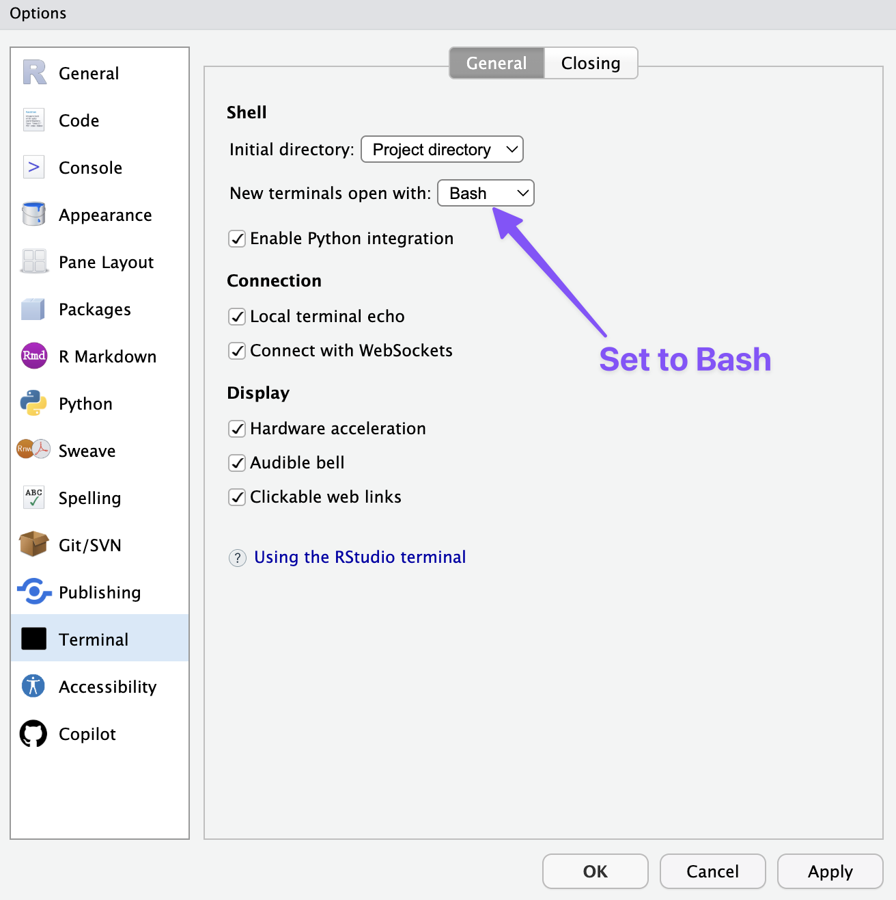

Check if you have git installed by going to the Terminal tab in the console pane of RStudio and running `git --version`. If you get a version as in @fig-gitcheck, you have git. If you get an error or another message, you do not.

{#fig-gitcheck width=60% fig-alt="A screen shot of the RStudio terminal showing the command git --version and its output if git is installed on your computer."}

If git is installed, you can move on to [Setting up Git and GitHub](git-setup.qmd), otherwise follow the instructions below.

## Windows
You can install Git and the command line Bash with [Git for Windows](https://gitforwindows.org). You can follow the instructions for Git for Windows at the [Carpentries](https://carpentries.github.io/workshop-template/install_instructions/#the-bash-shell).

## MacOS
Go into your Terminal app and type `git --version` and then press return to run it. If you have git installed, it will tell you the version.  

If git is not installed already, follow the instructions to Install the "command line developer tools". You do not need to download the Xcode application.

You can do this on the command line with: `xcode-select --install`.

## Check that you have Git in RStudio
After you download Git, you should restart RStudio to make sure you have a clean Terminal. Return to the Terminal tab as shown in @fig-gitcheck and run `git --version` to check that you have Git installed.

If everything works, you can move on to [Setting up Git and GitHub](git-setup.qmd). If you are still getting an error, check the resources on installing Git.

## Terminal settings in RStudio

### Windows
If you are on windows, the Terminal tab in RStudio may use the Command-Prompt by default. If the *prompt*---the character to the left of your cursor---is not a dollar sign (`$`), you should change your settings in RStudio to use Bash for new Terminals. Go to Tools -> Global Options. On the Terminal tab make sure that Bash is set for new terminals as shown in @fig-rstudio-bash.

## macOS
The default shell in macOS is [Zsh](https://en.wikipedia.org/wiki/Z_shell) and not [Bash](https://en.wikipedia.org/wiki/Bash_(Unix_shell)). If the *prompt*---the character to the left of your cursor---is a percentage sign (`%`), you are running Zsh. If it is a dollar sign (`$`), you are running Bash. The differences between these two shell programs are minimal and running one or the other will not affect anything you do in this course. If you want to change the shell in RStudio you can go to Tools -> Global Options as shown in @fig-rstudio-bash.

{#fig-rstudio-bash width=60% fig-alt="A screen shot of the RStudio settings with a purple arrow pointing to the New terminals open with setting and purple text that says set to Bash."}

## Resources: Installing Git
- [Carpentries instructions](https://carpentries.github.io/workshop-template/install_instructions/#git) for installing Git.
- Jenny Bryan, [Happy Git and GitHub for the useR: Install Git](https://happygitwithr.com/install-git).