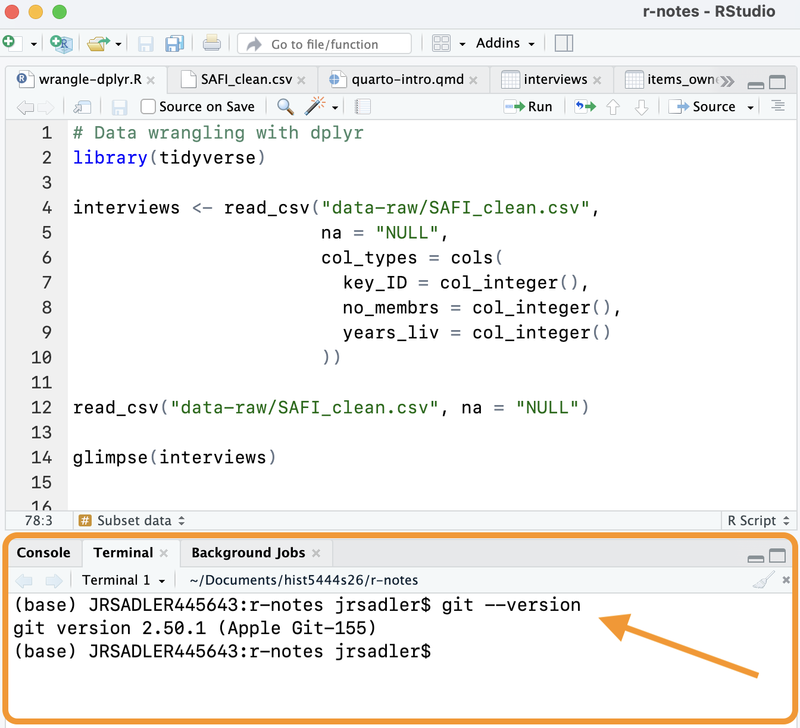

Check if you have git installed by going to the Terminal tab in the console pane of RStudio and running `git --version`. If you get a version as in @fig-gitcheck, you have git. If you get an error or another message, you do not.

{#fig-gitcheck width=60% fig-alt="A screen shot of the RStudio terminal showing the command git --version and its output if git is installed on your computer."}

If git is installed, you can move on to [Setting up Git and GitHub](git-setup.qmd), otherwise follow the instructions below.

## Windows
You can install Git and the command line Bash with [Git for Windows](https://gitforwindows.org). You can follow the instructions for Git for Windows at the [Carpentries](https://carpentries.github.io/workshop-template/install_instructions/#the-bash-shell).

## MacOS
Go into your Terminal app and type `git --version` and then press return to run it. If you have git installed, it will tell you the version.  

If git is not installed already, follow the instructions to Install the "command line developer tools". You do not need to download the Xcode application.

You can do this on the command line with: `xcode-select --install`.

## Check that you have Git in RStudio
After you download Git, you should restart RStudio to make sure you have a clean Terminal. Return to the Terminal tab as shown in @fig-gitcheck and run `git --version` to check that you have Git installed.

If everything works, you can move on to [Setting up Git and GitHub](git-setup.qmd). If you are still getting an error, check the resources on installing Git.

## Resources: Installing Git
- [Carpentries instructions](https://carpentries.github.io/workshop-template/install_instructions/#git) for installing Git.
- Jenny Bryan, [Happy Git and GitHub for the useR: Install Git](https://happygitwithr.com/install-git).