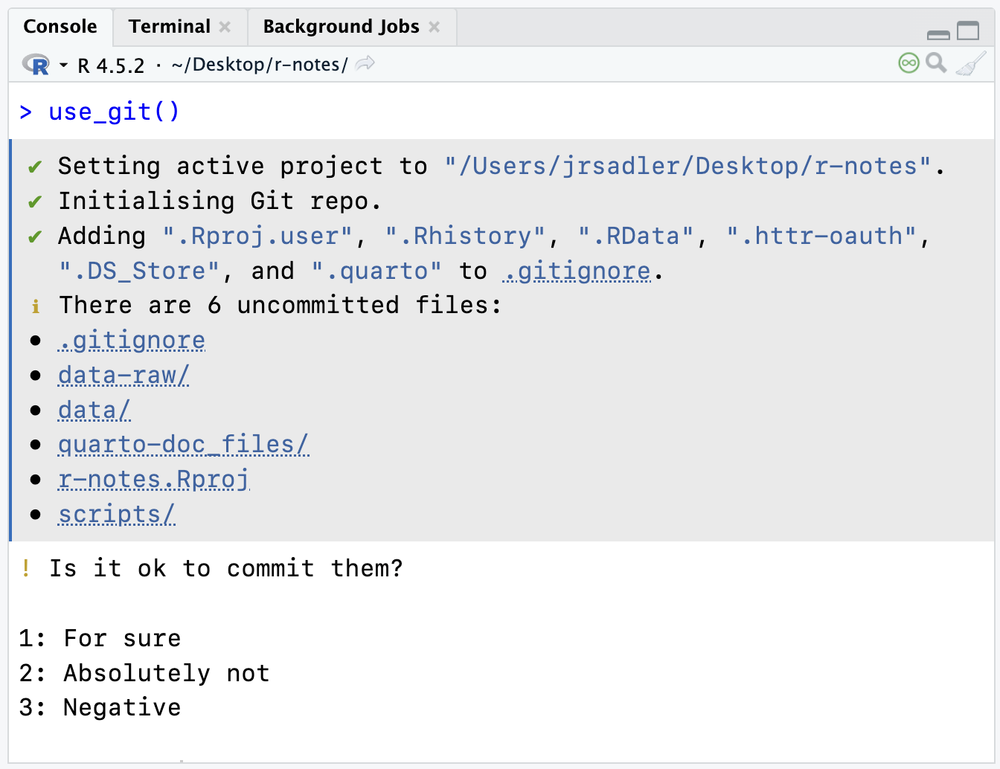
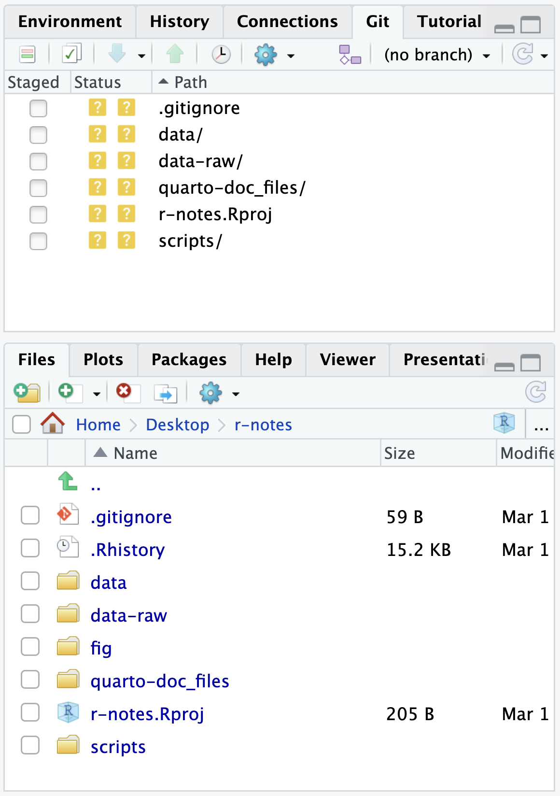

This page will break down the basic Git and GitHub workflow, concentrating on the workflow using R and RStudio. It will discuss three different interfaces for working with Git and GitHub: the command line, the [usethis package](https://usethis.r-lib.org/reference/index.html#git-and-github) helper functions, and RStudio's graphical Git interface.

- Command line interface commands look like `git command option` and will be run in the **Terminal** tab in RStudio.
- The usethis package functions all take the form of `use_*()`. They are R functions that do the command line commands for you. They will be run in the **Console** tab in RStudio.
- The graphical Git interface in RStudio is found in the Git tab in the upper-right pane. The project must be initialized as a Git project for the tab to appear. See @fig-git-pane.

## TL;DR
The basic steps for using Git are fairly straightforward, but they do involve more overhead than you will be used to in working on a project. One way to think about it is that Git forces you to be explicit about organizing the changes you make to your project.

1. Initialize your repository (project folder) as a Git project.
2. Make changes to the documents in the folder.
3. Add the changed files to the *stage*.
4. Commit those changed files as a save state with a commit message.
5. Repeat steps 2–4.
6. Push your changes to GitHub repository.

There are many different ways you can go about doing these foundational steps. Adding in GitHub to the mix brings in further complexity. Do you create the repository on GitHub first or on your computer. Let's go through creating a repository on GitHub first, which makes things a bit easier because each step actually combines multiple steps into one. Then, we will go through how to get our `r-notes` project on GitHub, which is a bit more manual.

For more background, see the options described in [Happy Git](https://happygitwithr.com/usage-intro).

## GitHub first
These instructions follow [Happy Git: New project, GitHub first](https://happygitwithr.com/new-github-first).

### 1. Make a new repository on GitHub
1. Go to [GitHub](https://github.com) and make sure you are signed in. In the upper-right click on the plus button and select `New Repository`.
2. Name your repository using the naming rules we have already defined. Make it short with **no** spaces, use lowercase letters.
3. Under configuration, you can keep everything as is, but select Add README to On.
4. Select Create Repository.
    - You will now be taken to the GitHub repository for your project.
    - This initialize the repository and makes the first commit.
5. Click on the [**green Code button**]{style="color:green"} on the top right.
    - Make sure HTTPS is selected.
    - Copy the URL to your clipboard.

### 2. New RStudio project from the GitHub repository
This step combines a number of steps that are usually separate. It creates a new folder that is an RStudio project, creates the connection between that project folder and the GitHub repository, and downloads the README we created in step 1. We can do this all with `usethis::create_from_github()`. Paste the url you copied from the GitHub repository that ends in `.git` into the first argument and choose where to put the new repository in the second argument.

```{r}
create_from_github(
  "https://github.com/YOU/YOUR_REPO.git",
  destdir = "~/path/to/hist5444s26/"
)
```

You should now be in a new RStudio project and in the upper-right pane you should have a Git tab.

### 3. Make local changes
1. Make changes to your files. Create new files.
2. Add the changed files to the stage by going to the RStudio Git tab and clicking on the check boxes alongside the files that have been modified.
3. Optionally look at the changes that have been made since the last commit by clicking on the `Diff` button above the list of files.
4. If not already in the Commit dialogue window, click on the Commit button.
5. Type in a commit message in the message box on the right and then click the Commit button.
6. Repeat steps 1–5 as many times as you want.

### 4. Push local changes to GitHub
There is no hard and fast rule for when you should push. Usually less often than you commit. It is more complex to change things back after you push.

1. Click on the blue `Pull` button in the RStudio Git tab.
    - This is done out of caution. In cases where you are working with other people, it is best to make sure you are up to date before pushing.
2. Click on the green `Push` button in the RStudio Git tab to send your changes to GitHub.
3. Confirm that the changes are on GitHub by going to the url of the repository.

You can now repeat steps 3 and 4 to make local changes and push to GitHub.

## Local first
These instructions follow [Happy Git: New project, Existing project, GitHub last](https://happygitwithr.com/new-github-first).

### 1. Initialize your project as a Git project
If it is a new RStudio project and a new folder, you can check on the Create a Git repository checkbox in the creation process. Your project will be set up as a Git repository from the beginning.

If it is a project you have already worked on (such as `r-notes`), open your project in RStudio. In the console run:

```{r}
library(usethis)
use_git()
```

You will be asked if you want to commit your files. In a larger project like `r-notes` you will want to do this manually, so select the number corresponding to no. In @fig-use-git this would be 2: Absolutely Not or 3: Negative. You do, however, want to restart RStudio.

The `use_git()` function runs `git init` on the command line and also adds a `.gitignore` file with good defaults ignored. If you ran `git init` in the Terminal tab, you can run `use_git_ignore()` to do the same thing. You should now have a Git tab in the upper-right pane and it should look like @fig-git-pane.

::: {layout="[65,35]"}
{#fig-use-git fig-alt="A screen shot of the RStudio console after running use_git(). It shows options for what to do with uncommitted files. 1 is For sure, 2 is Absolutely not, and 3 is Negative."}

{#fig-git-pane fig-alt="A screen shot of the RStudio Git and Files pane showing the state of things after initializing a project as a git repository."}
:::

### 2. Ignore files
There will be files you will not want to track via Git. In particular, data files, especially larger ones, and files produced by other files, such as the html output from Quarto documents. You can add specific files, folders, or file types to your `.gitignore` file.

1. Ignore data folders
    - Add `data-raw/` to a new line in `.gitignore`
2. Ignore Quarto produced files
    - Add `*_files/` and `*.html` on new lines in `.gitignore`. The asterisk stands in for any character, so we ar ignoring all folders that end in `_files` and all HTML files.

### 3. Stage and commit
Now it is time to stage and commit the files. Remember that this is a two step process. Stage the files, then commit the changes.

1. Stage the files
    - `git add filename` in the Terminal tab
    - Or click on the Staged checkbox in the Git tab in RStudio.
2. Commit
    - `git commit -m "First commit"` in the Terminal tab
    - Or click on the Commit button in the Git tab in RStudio and then write a commit message.
3. Check the status of the project with `git status` in the Terminal tab
    - This should return "nothing to commit, working tree clean".

### 4. Connect to GitHub
There is a fast way and a manual way to do this. Follow these instructions to do it manually, but you can also run `use_github()`. This will:

- Create a new repository on GitHub with the same name as you local project folder.
- Set that repository as the remote server for the project named `origin`.
- Push the contents of your local project to GitHub.
- Open a browser to the repository on GitHub.

It can do all of this because Git knows who you are and usethis has access to your GitHub personal access token. This is really useful, but it is also helpful to know what all of these steps are, so let's go through them using the command line interface.

1. Go to GitHub and create a new repository
    1. Clicking on the plus button in the upper-right and select `New Repository`.
    2. Name the repository the *exact* same name as the RStudio project, such as `r-notes`.
    3. Select Create Repository, making sure *not* to add anything. It should be an empty repository.
2. Add the GitHub repository as a remote server
    1. Click on the [**green Code button**]{style="color:green"} on the top right and copy the HTTPS URL.
    2. In the Terminal tab of the RStudio project that you are connecting to GitHub run `git remote add origin your-url-here`
        - This adds a remote server named `origin` at the url you provide.
3. Check the status of the remote server.
    - Run `git remote -v` in the Terminal tab.
    - The output to this should be the name of the remote (`origin`) followed by the Git url. You should have both fetch and push capabilities.
4. Push local files to GitHub
    - Run `git push --set-upstream origin main` in the Terminal tab.
    - Use of `--set-upstream` makes it so you only need to use the simple command `git push` or `git pull` in the future instead of `git push origin main`, where `origin` is the name of the remote server and `main` is the branch that you are pushing.
5. Check that changes propagated to GitHub.
    - Celebrate 🎉 your success if they did.

## The ongoing workflow
Now you can do your work and practice the Git and GitHub workflow.

1. Make changes to your project.
2. Add the changes to the stage and then commit with a message about the changes.
3. Repeat steps 1 and 2 until you feel you have made good progress.
4. Push the changes to GitHub.
5. Repeat.
