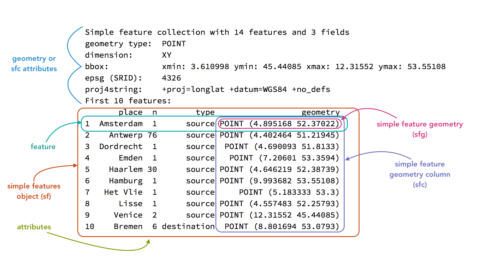

This page provides an introduction to mapping in R. It provides a very short overview of geospatial concepts and then introduces working with vector and raster data in R by creating a map of Virginia.

## Geospatial concepts
There are two main concepts in dealing with geospatial data:

1. The type of data and how it is represented: vector or raster.
2. How the data relates to the surface of the Earth: Coordinate reference system. Without a coordinate reference system (CRS), either implicit or explicit, the data is not spatial.

### Data types

#### Vector data
- Vector data are based on points, lines, and polygons within a coordinate system.
- Vector data are similar to the sorts of data we have been working with in creating scatter plots or line plots. It is represented in a data frame and has `x` and `y` coordinates.
- If you are working with points, lines, and polygons (land, oceans, lakes, political borders), you are dealing with vector data.

#### Raster data
- Raster data is based on a grid of cells in which each cell has one value.
- Raster data is not represented by a data frame but by a matrix: a vector with two dimensions. It does not work through `x/y` coordinates but from a point of origin, the extent of each cell, and the number of cells.
- Raster data can either be continuous (elevation) or discrete/categorical (soil type).
- Digital photography is based on raster data. If you zoom into raster data it will become pixelated.

### Coordinate Reference Systems
- Vector and raster data is made into spatial data by possessing a Coordinate Reference System (CRS), which translates coordinates (vector) or a grid of cells (raster) to space on the surface of the earth.
- There are two types of coordinate reference systems: Geographic and projected.
    - Geographic coordinate reference systems are measured in degrees of latitude and longitude, which are angles from the earth's center to its surface.
    - Projected coordinate reference systems transform the angular measurements on a spherical earth to a flat surface using linear units such as meters or feet.
    - Check out the [Map Projection Explorer](https://www.geo-projections.com) to get an idea of how different projections look and what they may be useful for.
- Components of coordinate reference systems:
    - **Datum**: A model of the shape of the Earth. Common global datums are WGS84 and NAD83.
    - **Projection**: Mathematical projection of 3D model of the Earth to 2D. Projections are often named based on a property they preserve:
		- Equal-area preserves area
		- Azimuthal preserve direction
		- Equidistant preserve distance
		- Conformal preserve local shape

### References
- Lovelace, Nowosad, and Muenchow, *Geocomputation with R*, [Chapter 2: Geographic Data in R](https://r.geocompx.org/spatial-class#crs-intro).
- [Data Carpentries: Introduction to Geospatial Concepts](https://datacarpentry.org/organization-geospatial/index.html).

## Packages for spatial data in R
See the [CRAN spatial analysis task view](https://cran.r-project.org/web/views/Spatial.html) for a complete guide to packages for spatial data in R.

### Spatial packages
- [sf: Simple features for R](https://r-spatial.github.io/sf/index.html): vector data in R.
- [terra: Raster geographic data in R](https://rspatial.github.io/terra/index.html): raster data in R.
- [tidyterra](https://dieghernan.github.io/tidyterra/): Integrate terra objects into the tidyverse and ggplot2.

### Spatial data packages
- [USAboundaries](https://docs.ropensci.org/USAboundaries/index.html): Historical boundaries from 1629 to 2000 for states and counties from the Newberry Library’s Atlas of [Historical County Boundaries](https://publications.newberry.org/ahcbp/) and historical city population data from Erik Steiner's [United States Historical City Populations, 1790–2010](https://github.com/cestastanford/historical-us-city-populations).
- [rnaturalearth](https://docs.ropensci.org/rnaturalearth/index.html): Provides access to the [Natural Earth](https://www.naturalearthdata.com/) vector data.
- [tidygeocoder](https://jessecambon.github.io/tidygeocoder/): Package to geocode locations using any of the many [supported geocoding services](https://jessecambon.github.io/tidygeocoder/articles/geocoder_services.html).
- [osmdata](https://docs.ropensci.org/osmdata/): Access to OpenStreetMap data.
- [tidycensus](https://walker-data.com/tidycensus/): Access to US Census Bureau data in a tidy format, including the option to bind the data spatially on import.
- [tigris](https://github.com/walkerke/tigris): Access to cartographic elements provided by the US Census Bureau TIGER, including cartographic boundaries, roads, and water.
- [giscoR](https://ropengov.github.io/giscoR/): Access to European geospatial data.
- [elevatr](https://github.com/USEPA/elevatr): An R package for accessing elevation data.

### Visualization of spatial data
- [ggplot2](https://ggplot2.tidyverse.org/index.html).
- [tmap: Thematic maps in R](https://r-tmap.github.io/tmap/): An alternative to plotting maps with ggplot2.
- [leaflet](https://rstudio.github.io/leaflet/): An R package for the [Leaflet](https://leafletjs.com/) open-source JavaScript library for interactive maps.
- [mapview](https://r-spatial.github.io/mapview/): Make quick interactive maps to view spatial data.
- [rayshader](https://www.rayshader.com): Create 3D maps in R.

## Vector data in R
The basis for working with vector spatial data in R is provide by the [sf: Simple features for R](https://r-spatial.github.io/sf/index.html) package. An `sf` object is a data frame that contains a special `geometry` column that brings together the coordinates and spatial type (point, line, polygon, etc.) and spatial attributes of the coordinate reference system (CRS) of the data. See @fig-sf.

{#fig-sf width=75% fig-alt="A screenshot of the printout for an sf object in R showing the geospatial attributes at the top followed by a data frame. There are boxes and labels pointing to the different aspects of an sf object."}

Aside from the special `geometry` column, `sf` objects behave very similar to data frames and, therefore, fit well within the th [tidyverse](https://tidyverse.org) set of packages. This means you can usually make use of the workflows discussed in [Wrangling data in the tidyverse](wrangling.qmd) as is.

Vector data will generally consist of points, lines, or polygons with attributes you want to represent graphically and, optionally, a separate base map such as @fig-va-map.

```{r}
#| label: fig-va-map
#| echo: false
#| message: false
#| fig-alt: "A map of Virginia counties with black points at Blacksburg and Charlottesville."
library(sf)
library(USAboundaries)
library(tidyverse)
library(tidygeocoder)

locs <- tibble(
    address = c("Blacksburg", "Charlottesville"),
    lat = c(37.22966, 38.02931),
    long = c(-80.41368, -78.47668)
    ) |>
  st_as_sf(coords = c("long", "lat"), crs = 4326)

virginia <- us_counties(states = "Virginia")
# Project
locs_proj <- st_transform(locs, "EPSG:32146")
virginia_proj <- st_transform(virginia, "EPSG:32146")

ggplot() + 
  geom_sf(data = virginia_proj) + 
  geom_sf(data = locs_proj) + 
  labs(title = "Map of Virginia counties",
       subtitle = "With points showing the locations of Blacksburg and Charlottesville") + 
  theme_minimal()
```

Let's go through the process of creating this map. For this map we need to geocode the locations, get a base map of the counties of Virginia, project the points and base map to the coordinate reference system for the state, and then make the map. We will do this using the following packages:

- [sf](https://r-spatial.github.io/sf/index.html) to represent the geospatial data.
- [tidygeocoder](https://jessecambon.github.io/tidygeocoder/) to geocode the locations.
- [USAboundaries](https://docs.ropensci.org/USAboundaries/index.html) for the base map and to find the CRS for the state.
- [ggplot2](https://ggplot2.tidyverse.org/index.html) to plot the map.

Do note that there are a variety of ways to achieve the same result.

```{r}
#| label: load-pkgs
#| eval: false
library(sf)
library(tidygeocoder)
library(USAboundaries)
library(tidyverse)
```

### 1. Geocode locations
One of the most straightforward but also flexible packages for geocoding locations in R is [tidygeocoder](https://jessecambon.github.io/tidygeocoder/). You can geocode a character vector of locations with `geo()` or a data frame of locations with `geocode()`. tidygeocoder provides a number of services for doing the geocoding, defaulting to [OpenStreetMap data](https://nominatim.org).

```{r}
#| label: geocode
#| eval: false
locations <- geo(c("Blacksburg", "Charlottesville"))
locations
```

```{r}
#| label: geocode-output
#| echo: false
locations <- tibble(
    address = c("Blacksburg", "Charlottesville"),
    lat = c(37.22966, 38.02931),
    long = c(-80.41368, -78.47668)
    )
locations
```

### 2. Convert locations to sf object
`locations` has geographic data, but it is not technically geospatial. The addresses have latitude and longitude values, but the coordinate reference system used is implicit. When data is geocoded it is almost always returned using the web Mercator projection known  as EPSG 4326. The EPSG standard is a convenient method for defining a CRS. You can look up EPSG codes using [Spatial Reference](https://spatialreference.org). We can convert the data frame to a spatial data frame---an `sf` object---with the `st_as_sf()` function.

```{r}
locations_sf <- st_as_sf(locations, coords = c("long", "lat"), crs = 4326)
locations_sf
```

Notice the differences between `locations` and `locations_sf`. The latter has combined the `long` and `lat` columns into a single `geometry` column, while we also get attributes about the object's CRS as shown above in @fig-sf.

### 3. Get a base map
There are many packages that provide vector mapping data in R. [rnaturalearth](https://docs.ropensci.org/rnaturalearth/index.html) is a great starting point. It contains worldwide data for administrative boundaries and natural features such as lakes, rivers, and oceans. [tigris](https://github.com/walkerke/tigris) provides access to census bureau geographic data. In this example we will use [USAboundaries](https://docs.ropensci.org/USAboundaries/index.html), which provides contemporary and historical boundaries in the United states. Both rnaturalearth and USAboundaries provide most of the data through secondary packages. If these packages are needed, you will be prompted to install them.


::: {.callout-warning collapse=false}
## Installing data packages on Windows
If the installation fails on Windows with an error that the package cannot be built, there are two options to solve the issue.

1. Download and install [RTools](https://cran.r-project.org/bin/windows/Rtools/), which makes it possible to build packages.
2. Install the package from a different repository: 

```{r}
#| eval: false
install.packages("USAboundariesData", repos = c("https://ropensci.r-universe.dev"))
```

The process is the same for rnaturalearth:

```{r}
#| eval: false
install.packages("rnaturalearth")
install.packages("rnaturalearthdata", repos = c("https://ropensci.r-universe.dev"))
install.packages("rnaturalearthhires", repos = c("https://ropensci.r-universe.dev"))
```

:::

Both rnaturalearth and USAboundaries return `sf` objects with a CRS of EPSG:4326. Here, we want county data for a single state.

```{r}
virginia <- us_counties(states = "Virginia")
```


### 4. Reproject the data
Now we have the data, but we might want to change our data from using the web Mercator projection to a CRS that more accurately reflects the local area. USAboundaries provides both a data frame of the [State Plane Coordinate System](https://en.wikipedia.org/wiki/State_Plane_Coordinate_System) projections as EPSG codes and a function to quickly return the code for a state. We can then use `st_transform()` to reproject the data.

```{r}
# Find EPSG code for Virginia
state_plane(state = "VA")

# Project
locs_proj <- st_transform(locs, "EPSG:32146")
virginia_proj <- st_transform(virginia, "EPSG:32146")
```

### 5. Map the data
ggplot2 has the ability to plot `sf` through `geom_sf()`. This is a special geom in that it can plot different geometric objects---points, lines, polygons---based on the `geometric type` of the `sf` object. Note that in creating maps with ggplot2 you will often being providing multiple data objects to separate geom layers. When doing this, the `data` argument should be written out, thus `geom_sf(data = virginia_proj) `.

```{r}
#| label: fig-va-map2
#| fig-alt: "A map of Virginia counties with black points at Blacksburg and Charlottesville."

ggplot() + 
  geom_sf(data = virginia_proj) + 
  geom_sf(data = locs_proj) + 
  labs(title = "Map of Virginia counties",
       subtitle = "With points showing the locations of Blacksburg and Charlottesville") + 
  theme_minimal()
```

### Create an interactive plot with leaflet
[leaflet for R](https://rstudio.github.io/leaflet/index.html) provides an interface to the widely used [leaflet](https://leafletjs.com) JavaScript library. Let's take our map and create a simple interactive map.

```{r}
#| label: fig-leaflet
#| fig-alt: "A map of Virginia counties with black points at Blacksburg and Charlottesville."
library(leaflet)

leaflet() |> 
  addTiles() |> 
  addPolygons(data = virginia,
              fillOpacity = 0,
              color = "#000",
              weight = 2) |>
  addMarkers(data = locs, label = ~address)
```

You can make quite complex maps using leaflet, and, as you can see here, they can be placed right into Quarto documents.

## Raster data in R
Historical data is generally vector data, but there may be times when raster data can either supplement a map with vector data or be a meaningful way to present historically relevant data in itself. One particularly relevant form of raster data elevation. Let's get some elevation data using the following packages:

- [terra: Raster geographic data in R](https://rspatial.github.io/terra/index.html): raster data in R.
- [tidyterra](https://dieghernan.github.io/tidyterra/): Integrate terra objects into the tidyverse and ggplot2.
- [elevatr](https://github.com/USEPA/elevatr): An R package for accessing elevation data.

```{r}
#| message: false
library(terra)
library(tidyterra)
library(elevatr)
```

### 1. Get elevation raster
The [elevatr](https://github.com/USEPA/elevatr) package provides a way to download elevation data, using a spatial data object to define the boundaries of the raster to be returned. Currently, `get_elev_raster()` returns a `raster` object, which we can update to a `terra` object with the `rast()` function. The `z` level provides a zoom level between 1 and 14 with 1 as the most zoomed out and 14 as the highest resolution. The larger geographic area you want the lower zoom level you will need. Setting `clip = locations` returns a raster only inside the boundaries of the `virginia` `sf` object.

```{r}
#| message: false
va_elev <- get_elev_raster(virginia, z = 7, clip = "locations")
va_elev <- rast(va_elev)
va_elev
```

A `terra` object (specifically this is a `SpatRaster`) is similar to an `sf` object in that it is normal R data object with spatial attributes. However, instead of holding data in a data frame, a `terra` object uses a matrix of values. It will rarely be useful to see the values themselves, but the print method for `SpatRaster` provides an overview of the dimensions of the raster, the number of layers (`nlyr`), the name of the layer(s), and the minimum and maximum values.

### 2. Clean the raster data
The [tidyterra](https://dieghernan.github.io/tidyterra/) makes it possible to manipulate `terra` objects using dplyr verbs, provides special geoms for plotting `terra` objects in ggplot2, and color palettes designed for geographic data. You might notice that the minimum value is less than 0, which is probably an error. We can change anything less than 0 to -1 with `mutate()`, treating the `name` of the layer as the column name. First, we might want to rename the layer `name` to a more descriptive name than the file number.

```{r}
#| label: rename-layer
names(va_elev)
# Rename in place
names(va_elev) <- "altitude"

# Change values less than 0
va_elev <- va_elev |>
  mutate(altitude = if_else(condition = altitude < 0,
                            true = -1,
                            false = altitude))
va_elev
```

### 3. Reproject the data
Next, we need to project the `terra` object into the CRS for virginia. In terra you do this with `project()`.

```{r}
# project the data
va_elev <- project(va_elev, "EPSG:32146")
va_elev
```

### 4. Map the data
Let's take a look at what we have. We can plot with ggplot2 using `geom_spatraster()` from tidyterra and play around with different `scale_fill_*()` functions provided by tidyterra. Check out the color palette options at the [tidyterra website](https://dieghernan.github.io/tidyterra/reference/index.html#scales). This example uses wikipedia colors. Within `geom_spatraster()` setting the `fill` aesthetic will be done automatically, so it is not strictly necessary in this case where there is only the one layer.

```{r}
#| label: fig-elev
#| message: false
#| fig-alt: "A map of the elevation of Virginia."

ggplot() + 
  geom_spatraster(data = va_elev, aes(fill = altitude)) + 
  scale_fill_wiki_c() + 
  theme_minimal()
```

## Put it all together

Finally, let's put it all together, plotting the raster and vector data together. Note that layers are plotted in order, so we want to plot the raster first and then the vector data. We also need to make the `fill` of the counties base map (`virginia_proj`) to transparent using `NA`.

```{r}
#| label: fig-va-elev
#| message: false
#| fig-alt: "A map of Virginia counties with black points at Blacksburg and Charlottesville."

ggplot() + 
  geom_spatraster(data = va_elev) + 
  geom_sf(data = virginia_proj, fill = NA) + 
  geom_sf(data = locs_proj) + 
  scale_fill_wiki_c() + 
  labs(title = "Map of Virginia counties",
       subtitle = "With points showing the locations of Blacksburg and Charlottesville",
       fill = "Altitude") + 
  theme_minimal()
```

## Further resources
- Robin Lovelace, Jakub Nowosad, and Jannes Muenchow, [*Geocomputation with R*](https://r.geocompx.org) (2nd Edition).
    - Specifically, read over [Chapter 2: Geographic data in R](https://r.geocompx.org/spatial-class). This chapter provides an overview of vector and raster data in R, as well as coordinate reference systems.
    - Skim over the content of the other chapters in the book to see what may be of interest to you.
- Edzer Pebesma and Roger Bivand, *Spatial Data Science: With Applications in R* (2025), <https://www.r-spatial.org/book>.
- Kyle E. Walker, *Analyzing US Census Data: Methods, Maps, and Models in R* (CRC Press, 2023), <https://walker-data.com/census-r/>.
- [Spatial Data Science with R and terra](https://rspatial.org/index.html)
- Kieran Healy, *Data Visualization: A Practical Introduction*, [Chapter 7: Draw Maps](https://socviz.co/07-maps.html).
- Martijn Tennekes and Jakub Nowosad, *Spatial Data Visualization with tmap: A Practical Guide to Thematic Mapping in R* (2025), <https://tmap.geocompx.org>.
- Jesse Sadler, [An Exploration of Simple Features for R](https://www.jessesadler.com/post/simple-feature-objects/).
- [Data Carpentries: Introduction to Geospatial Concepts](https://datacarpentry.org/organization-geospatial/index.html).
- [Data Carpentries: Introduction to Geospatial Raster and Vector Data with R](https://datacarpentry.github.io/r-raster-vector-geospatial/index.html).