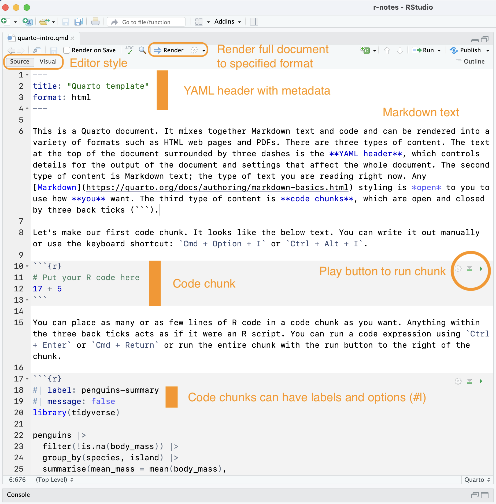
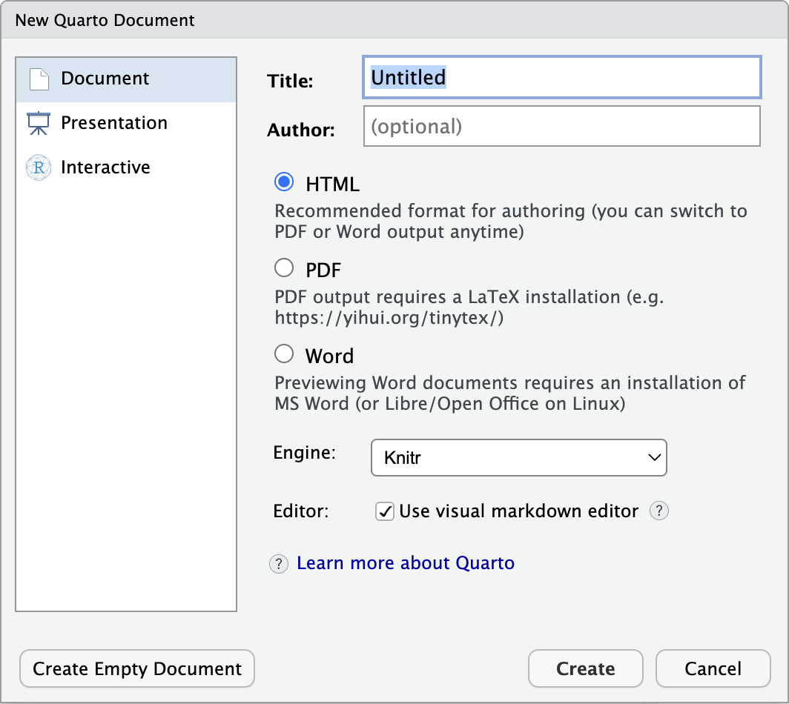

Quarto documents provide a way to mix together [Markdown text](plaintext.qmd) with code and its results. Whereas **R scripts** are designed primarily for writing and running code---with comments (`#`) giving a means to document the code---**Quarto documents** allow you to write prose alongside code. You can then output the Quarto document into a number of formats, including web pages, PDFs, slides, and even Word documents. Projects of connected Quarto documents can create [books](https://quarto.org/docs/books/) and full [websites](https://quarto.org/docs/websites/). Why might you use Quarto documents instead of an R script?

1. To communicate a data analysis with calculations and visualizations, but you do not need the code that produced the analysis to be shown in the final document.
2. If you want to write extensive text or write structured text with Markdown between your blocks of code.
3. If you want to create a stylized output such as web pages, PDFs, slides, and more from Markdown whether it includes code or not.

To get familiar with Quarto, **please download** this [Quarto template document](../files/quarto-intro.qmd), place it in your `r-notes` project, read through it, and then render it into an HTML document.

## Resources
The rest of this page goes over the foundations of Quarto documents, but there are a couple of very good resources that should be consulted to get a fuller understanding of how and why to use Quarto documents.

- A good place to start is with the [Getting started with Quarto tutorial for RStudio](https://quarto.org/docs/get-started/hello/rstudio.html). It provides an overview of how to write and render Quarto documents into a variety of formats in RStudio. Make sure to go through all three pages of Hello, Quarto, Computations, and Authoring.
- Once you have gone through the tutorial, look over the [Quarto](https://r4ds.hadley.nz/quarto.html) chapter of *R for Data Science*.
- The [Quarto documentation](https://quarto.org/docs/guide/) is very good and very in depth. It is a good place to return to each time you have a question. Some particularly useful pages include:
    - [Markdown basics](https://quarto.org/docs/authoring/markdown-basics.html)
    - [Using R](https://quarto.org/docs/computations/r.html)
    - [Quarto in RStudio](https://quarto.org/docs/tools/rstudio.html)
    - [HTML basics](https://quarto.org/docs/output-formats/html-basics.html)

## Quarto foundations
A Quarto document is a plain text file that has a `.qmd` extension. It contains three basic components:

1. A [YAML header](https://en.wikipedia.org/wiki/YAML) contained within lines with three dashes (---).
2. Markdown text.
3. Code chunks set off by three back ticks (```).

{#fig-quarto-doc width=60% fig-alt="A screen shot of a Quarto document in RStudio showing the three main components of a YAML header, markdown content, and code chunks."}

The key distinguishing feature between Quarto documents and R scripts is that you can **render** Quarto documents to different outputs. Rendering a Quarto document with the Render button or `Cmd/Ctrl + Shift + K` runs the R (or Python) code, producing outputs and converting the document to a Markdown document. It then uses [Pandoc](https://pandoc.org/) to convert the Markdown document to whatever output is specified in the YAML heading. The process is shown in @fig-quarto-flow.

{#fig-quarto-flow width=60% fig-alt="A diagram showing the flow of Quarto documents from qmd file through knitr to markdown and then through Pandoc to multiple outputs."}

### Quarto in RStudio
The [Get Started](https://quarto.org/docs/get-started/) page of the Quarto documentation shows that you can write Quarto documents in a variety of applications. However, RStudio has many built-in functions that make it easier to work with Quarto documents. You can make a new Quarto document by going to File -> New Document -> Quarto Document... You can add information to the dialogue to fill in the YAML heading, or you can choose Create Empty Document.

{#fig-quarto-new width=60% fig-alt="A screenshot of the new Quarto Document dialogue in RStudio."}

Quarto documents can be edited in either the [Visual editor](https://quarto.org/docs/visual-editor/) or the Source editor. The Visual editor styles your text as you go, whereas the source editor will give you an interface that is more similar to R scripts. You can change back and forth with the buttons at the top of the editor pane, but do note that this can slightly change how your Markdown is written.

## Quarto's three components

### YAML header

The YAML header provides a way to indicate the title of the document, document metadata such as author, the output format(s), and document wide options. [YAML](https://en.wikipedia.org/wiki/YAML) is a way to store data in a human-readable form. Its basic structure is `key: value`. The YAML heading is set off by three dashes `---`. A somewhat complex heading might look like this:

```
---
title: "My title here"
author:
  - name: "Jesse Sadler"
    email: jrsadler@vt.edu
    affiliation: "University Libraries"
date: last-modified
format:
  html:
    toc: true
    abstract: |
      This is the abstract.

      It has two paragraphs.
execute:
  echo: false
  warning: false
---
```

The available keys can be found in the documentation for each type of output. Many options are shared across document output types, but some are not. See the [HTML options](https://quarto.org/docs/reference/formats/html.html) for the widest number of options. It can be difficult to write these YAML headers, but happily in practice it is unlikely to be as difficult it looks. Firstly, you will not need to write complex YAML headers often. Secondly, you can figure out settings that work for you and then copy and paste them into other documents. There are also ways for YAML options to be used for all documents in a [project](https://quarto.org/docs/projects/quarto-projects.html) such as a website.

### Markdown
Unlike R scripts where default text is code, the default text in Quarto documents is Markdown. Use [Resources: Markdown syntax](markdown-syntax.qmd) for Markdown foundations, and look at the [Quarto Markdown documentation](https://quarto.org/docs/projects/quarto-projects.html) for more details on the style of Markdown you can use in Quarto documents.

### Code chunks
With Markdown as the default editing environment, your code must be placed in code chunks set off by three back ticks (```). They look like this:

```{r}
#| echo: fenced
24 + 87
```

You can create code chunks in RStudio with:

1. The keyboard shortcut: `Cmd + Option + I` or `Ctrl + Alt + I`.
2. Typing the chunk delimiters ```` ```{r} ```` and ```` ``` ````.

Once inside a code chunk, text functions as it does in an R script. Comments are made with `#`. Everything else is code. You can run the expressions in a chunk with `Cmd + Return` or `Ctrl + Enter`. Or you can run the entire chunk with the **play** button at the top right of the chunk. The output of the chunks will either be placed directly below the chunk or sent to the console. You can alter this in Global Options -> R Markdown tab -> Show output inline for all R Markdown documents checkbox. See also Other tweaks section in [Setting up RStudio for success](rstudio-setup.qmd#other-tweaks).

The primary difference between code chunks and R scripts is that code chunks can have special comments created with `#|` that provide options for the output of the chunk. These are formatted as YAML and override any defaults set in the YAML header. You can see the full list of options in the [Quarto documentation](https://quarto.org/docs/reference/cells/cells-knitr.html).

```{r}
#| echo: fenced
#| label: some-math
#| eval: false
24 + 87
```

The `label` option names the chunk, making it easier to refer to the chunk and to see it in the outline in RStudio. `label` names should be short and not include spaces. It is recommended to use a dash between words.

The main options that affect the **execution** of code are:

- `eval: false` prevents the code from being run. The code displays but does not run.
- `echo: false` prevents the code from being shown in the output, but the code is run and outputs are shown. This is useful when you want people to see the output but the code does not need to be read by the audience.
- `include: false` prevents the code and outputs from being shown, though the code is run. This is useful for setup code.
- `message: false` or `warning: false` prevents messages or warnings from being output in the rendered document.

The other options you might want to change are the **figure output**. See [*R for Data Science*](https://r4ds.hadley.nz/quarto.html#sec-figures) for more details.

- To set the size of the plot from ggplot2:
    - `fig-width: 6`
    - `fig-asp: 0.618`: Aspect ration of width to height. With this you do not need to set the width. `0.618` is the golden ratio.
    - `fig-width: 4`: But you can set width instead of aspect.
- Control the output size within the output document:
    - `out-width: "70%"`: This would take up 70% of the content area.
    - `fig-align: center`: How to align the plots.

## Conclusion
This is just the tip of the iceberg for what you can do with Quarto documents. But you can do a lot with these foundations. Check out the [Resources](#resources) above for places to start if this document does not cover a question you have.