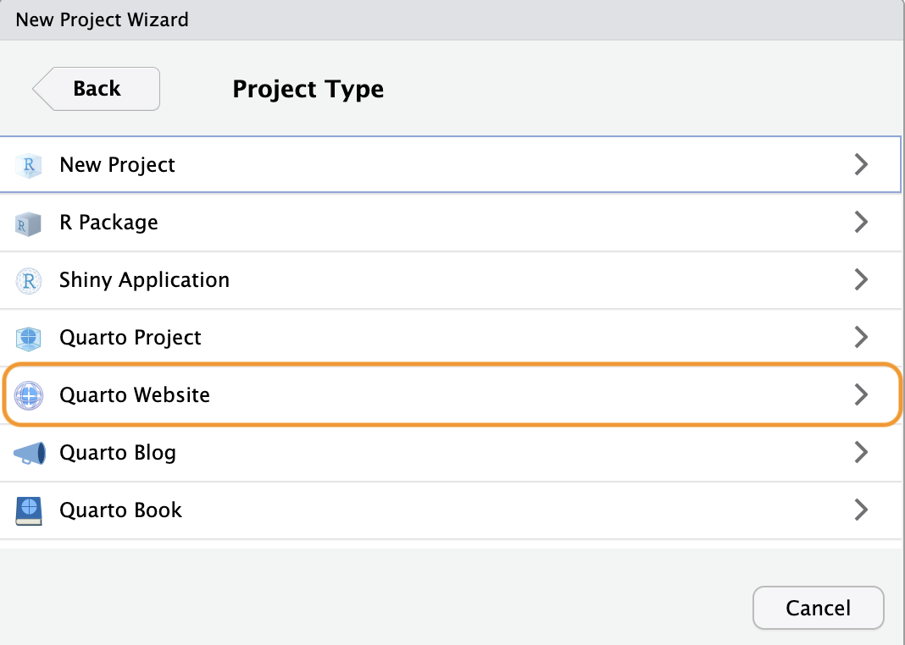
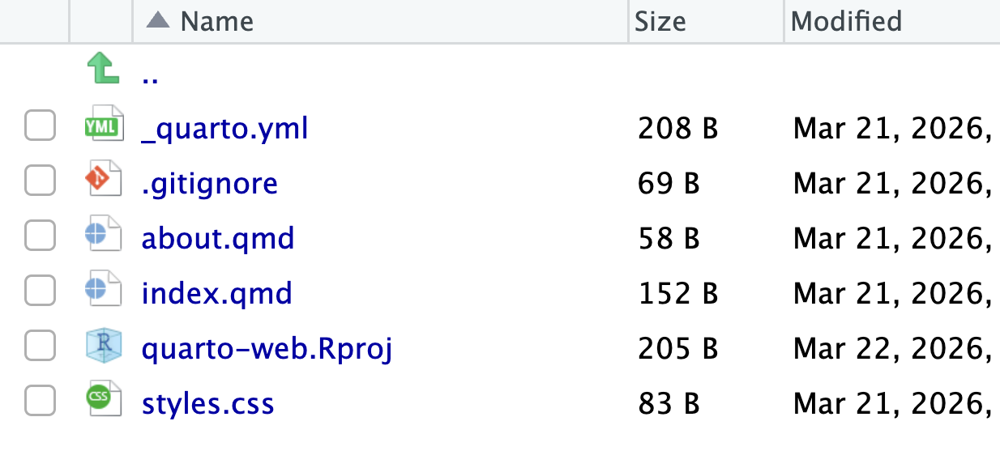
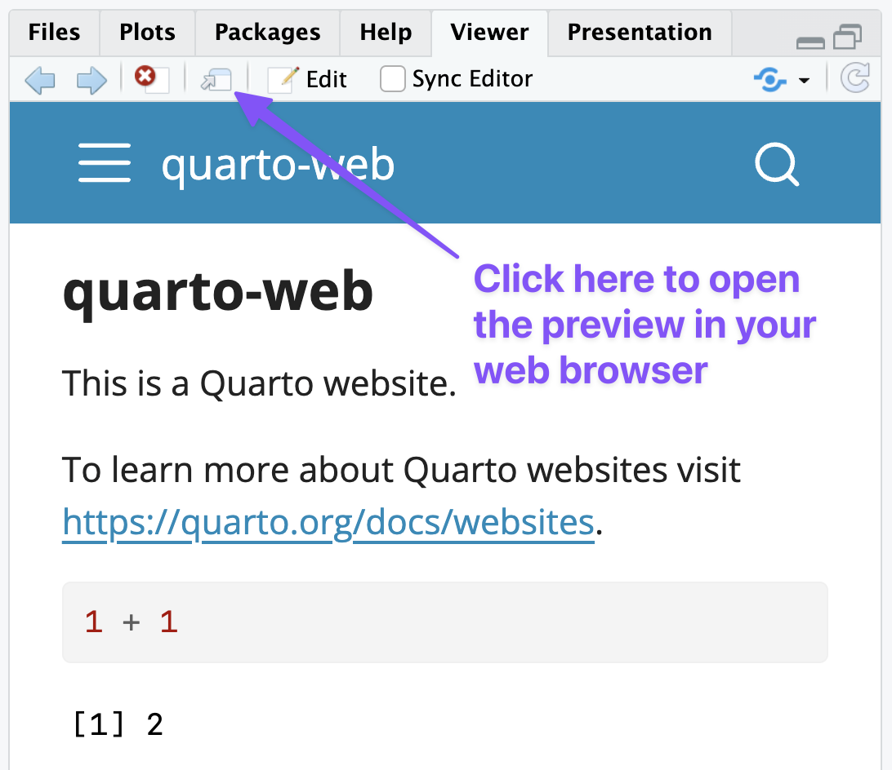
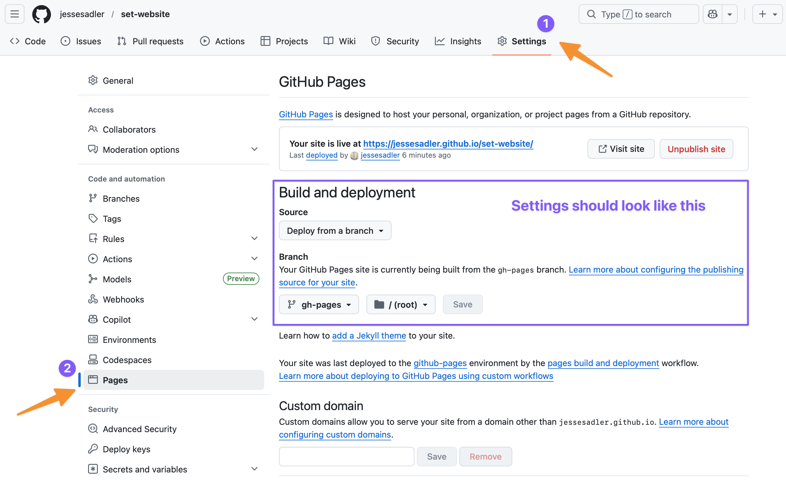

[Quarto websites](https://quarto.org/docs/websites/) are a collection of Quarto documents using `format: html` with a set structure and consistent visual style. This page will guide you through setting up a Quarto website project, outline some of the structures and features of Quarto websites, and show how to deploy a Quarto website to the internet using GitHub Pages.

## Resources
The Quarto documentation is the best place to look when you have a question. The documentation will be linked extensively below, but the most important pages are:

- [Creating a website](https://quarto.org/docs/websites/)
- [Website navigation](https://quarto.org/docs/websites/website-navigation.html)
- [HTML basics](https://quarto.org/docs/output-formats/html-basics.html)
- [HTML theming](https://quarto.org/docs/output-formats/html-themes.html)
- [Publishing to GitHUb Pages](https://quarto.org/docs/publishing/github-pages.html)

Posit has also created a YouTube series on [building a Quarto website](https://youtu.be/l7r24gTEkEY?si=QGzhARrLgHJ-gpxk). This series also discusses making a [blog with Quarto](https://quarto.org/docs/websites/website-blog.html). A blog is a Quarto website that has some additional features to allow you to have a page listing the blog posts. Otherwise, there is a great deal of overlap.

### Examples of Quarto websites
There are a lot of Quarto websites out in the world. A couple that you might want to look at include:

- The website for [this class](https://jessesadler.github.io/vt5444s26/) is a Quarto website.
- [OpenScapes](https://openscapes.org)
- [Andrew Heiss](https://www.andrewheiss.com/)
- [Ted Laderas](https://laderast.github.io)
- [Affective Communication & Computing Lab](https://affcom.ku.edu)

## Creating a Quarto website
Creating a website with RStudio is done in the same way as creating a new project. Go to File -> New Project... or click on New Project in the Project dropdown at the top-right of RStudio. See [Setting up RStudio for success](rstudio-setup.qmd#rstudio-projects) for more details. When in the New Project dialogue window, select New Directory, and then under Project Type choose Quarto Website as in @fig-website-create. Give the new project folder a name, remembering the naming guidelines, and place it in your `vt5444s26` folder. This will be an example website, so do not worry about the name right now. You can also 

{#fig-website-create width=50% fig-alt="A screen shot of the RStudio new project wizard with an orange box highlighting the selection of Quarto website as the type of project."}

RStudio will start up a new session in your new project folder with a few template documents to get you started on your website as shown in @fig-website-files.

{#fig-website-files width=50% fig-alt="A screen shot of RStudio showing the files created by making a new Quarto website project. The files are: _quarto.yml, .gitignore, about.qmd, index.qmd, an Rproj file, and styles.css."}

## Render and preview your website
Click on the `Render` button at the top of the RStudio editor panel to [build your website and preview what it looks like](https://quarto.org/docs/websites/#website-preview). This can also be done by running the command `quarto preview` in the Terminal.[^1] When the website is rendered, a new `_site` folder will be created. This folder contains all of the HTML files that make up your website. You will also see the preview of the site open in the View panel on the right. You can click on the Show in new window button as shown in @fig-website-preview to open the preview in your browser.

{#fig-website-preview width=50%  fig-alt="A screen shot of the Viewer panel in RStudio showing a preview of the newly created website. There is a purple arrow pointing to the external viewer button."}

Open up `index.qmd` and make some changes to the text. Save the file and then click on Render, or check the box for Render on save, and see what happens. The website updates with the new content. This is the basic workflow for working on a Quarto website. Make some changes and then see what they look like by previewing them.

## How Quarto websites work
Let's now dig into the files that were created with the website project to understand a bit more about the different types of files and how they work to create a website. There are three types of files in the website template that represent the three main types of files used to create a Quarto website.

1. Quarto documents: Each document is a web page.
2. `_quarto.yml`: Configuration file that determines the structure of the website and website wide settings.
3. A CSS or SCSS style sheet that sets the style for the website.

Let's go through these one by one.

### 1. Quarto documents
Each document is a web page. `index.qmd` and `about.qmd` are special pages. All other Quarto documents are other web pages. See the [HTML documents](https://quarto.org/docs/reference/formats/html.html) documentation on options for HTML documents.

- `index.qmd` is the home page.
- `about.qmd` is about page that has some special themes.

The YAML heading for each document can be very simple because `_quarto.yml` can be used to set the options for the whole site.

### 2. Configuration file
`_quarto.yml` is a YAML file that determines the structure of the website and sets website wide options. The [Website navigation](https://quarto.org/docs/websites/website-navigation.html) documentation shows the different options for setting up the structure of the website. You can use a [top navigation bar](https://quarto.org/docs/websites/website-navigation.html#top-navigation), a [side bar](https://quarto.org/docs/websites/website-navigation.html#side-navigation), or a [combination of the two](https://quarto.org/docs/websites/website-navigation.html#hybrid-navigation).

The `_quarto.yml` configuration file can also be used to set website-wide options for the webpages such as whether to include a table of contents or the numbering of sections among many others. See the [HTML options page](https://quarto.org/docs/reference/formats/html.html) for a complete list of choices available to you.

### 3. Styles and theme
The [HTML theming](https://quarto.org/docs/output-formats/html-themes.html) and [More about themes](https://quarto.org/docs/output-formats/html-themes-more.html) documentation goes into the details on styling you website.

Quarto websites use a base theme that is set within the `_quarto.yml` configuration file. Quarto themes are based on the 25 [bootswatch](https://bootswatch.com/) themes, which can be set under the `theme` key. You can also set important [base styling options](https://quarto.org/docs/output-formats/html-themes.html#basic-options) within the `_quarto.yml` file.

But, if you want to alter any aspect of the style of you website, you can do so using CSS (Cascading Style Sheets). However, Quarto is set up to use [Sass](https://sass-lang.com) or a `.scss` file. See the [Sass variables](https://quarto.org/docs/output-formats/html-themes.html#sass-variables) documentation on how to change styling options with a `.scss` file.

## Deploying Quarto websites to GitHub Pages
These instructions show how to deploy a Quarto website to GitHub pages using a GitHub Action. See the [instructions here](https://quarto.org/docs/publishing/github-pages.html) from the Quarto documentation for more details. GitHub pages uses a special `gh-pages` branch to host static websites created by tools such as Quarto.

1. Set up local repository to use GitHub Actions
	1. Add `/.quarto/` and `/_site/` to `.gitignore` file.The `_site/` folder is created from the Quarto files and will be created by the GitHub action set up in step 7.

		``` {.txt filename=".gitignore"}
		/.quarto/
		/_site/
		```

	2. Set `freeze: auto` in `_quarto.yml`: This makes it so Quarto will only rerender a file if it has changed, making the preview and render workflow faster. See the documentation on use of [freeze](https://quarto.org/docs/projects/code-execution.html#freeze).

		``` {.yaml filename="_quarto.yml"}
		execute:
		  freeze: auto
		```

	3. Render site to create a `_freeze` folder.
    4. Add and commit the changes to `.gitignore`, `_quarto.yml` and the `_freeze` folder. Anytime changes occur in `_freeze`, these should be included in your commit.
2. Create connection to GitHub using [Local first method](git-workflow.qmd#local-first)
	1. Create empty repository on GitHub with the same name as your website project.
	2. Add remote with `git remote add origin your-url-here`
	3. Push and `set-upstream` to GitHub: `git push --set-upstream origin main`
3. Create `gh-pages` branch on local repository
	- Make sure you have committed all changes to your current working branch with `git status`.
	- Close all of your tabs in RStudio. The following actions will delete all of your files on the new branch. This is ok!
	
    ```bash
	git checkout --orphan gh-pages
	git reset --hard # make sure all changes are committed before running this!
	git commit --allow-empty -m "Initialising gh-pages branch"
	git push origin gh-pages
    ```

4. Switch back to main branch

    ```bash
	git switch main
    ```

5. Check GitHub Pages setup
	- Go to GitHub
	- Click on the Branches dropdown in the upper left that should say main and then click View all branches.
	- Go to Settings -> Pages
	- check that the Source branch for your repository is `gh-pages` and that the site directory is set to the `/(root)` repository as shown in @fig-gh-pages.
6. Make first publish
	- Make sure you are on your `main` branch. You can check this in the Git Tab of RStudio or by running `git branch` in the Terminal.
	- Run `quarto publish gh-pages` in the Terminal and then enter Y for yes.
7. Add GitHub publish action
	- Add `.github/workflows/publish.yml` copying from the [Publish action](https://quarto.org/docs/publishing/github-pages.html#publish-action) in the Quarto documentation.
	- Add and commit the new file.
8. Push your project to GitHub
    - Make a push to GitHub: `git push`.
    - You should now be able to return to the repository page on GitHub and see an Action running. Click on the Action tab to see the progress.
    - If the action runs correctly, the website should be online and updated.
    - In the repository page on GitHub click on the gear button in the About section on the right. Click on the box to use your GitHub pages website as the url of the project. This will make it easier to click over to your website.

{#fig-gh-pages width=75% fig-alt="A screen shot of GitHub showing how to get to the GitHub Pages web page through Settings and Pages."}

## The website workflow
With the GitHub Action set up the website workflow is largely the same as the normal Git and GitHub workflow with one minor change. You should make sure to preview and render your changes before making a push to GitHub.

1. Make changes to your website project.
2. Preview the website to see that everything works and to ensure that the `_freeze` folder is updated.
3. Add and commit the local changes.
4. Repeat steps 1–3.
5. Push to GitHub to make your changes live to your website.


[^1]: Quarto is first and foremost a command line tool. Therefore, all of the commands you run in RStudio can also be done in the Terminal.
